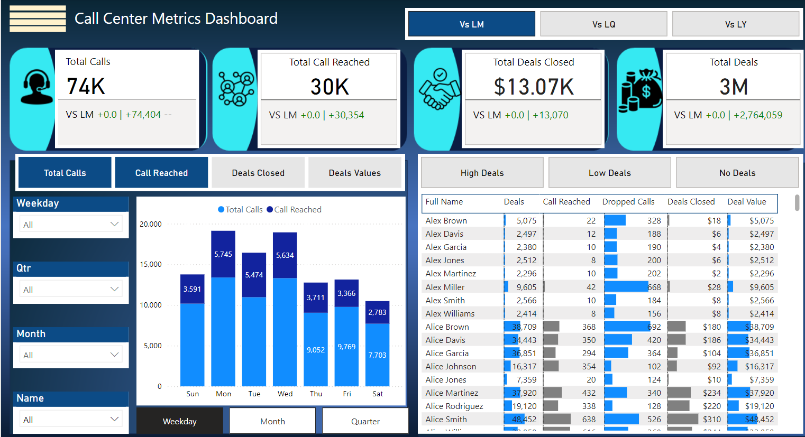

# Call Center Metrics Dashboard

## **Problem Statement**

The dashboard focuses on analyzing Call Center Metrics, specifically:
- Total Calls, Calls Reached, and Deals Closed, along with Deal Values.
- Performance by agents, identifying high-value contributors, and understanding dropped calls.
- Trends in metrics based on time (e.g., weekdays, quarters, and months).
- Comparison of performance vs. Last Month (LM), Last Quarter (LQ), and Last Year (LY).
  
   **The primary objective is to identify areas for improving call efficiency, deal conversion rates, and reducing dropped calls to maximize revenue**
