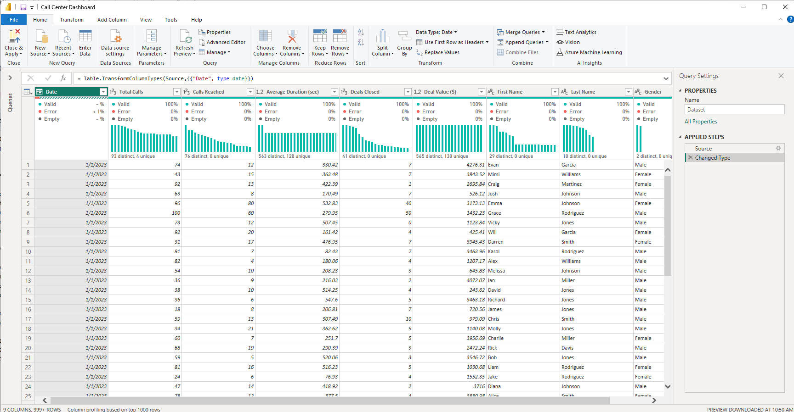

# Call Center Metrics Dashboard

## **Problem Statement**

The dashboard focuses on analyzing Call Center Metrics, specifically:
- Total Calls, Calls Reached, and Deals Closed, along with Deal Values.
- Performance by agents, identifying high-value contributors, and understanding dropped calls.
- Trends in metrics based on time (e.g., weekdays, quarters, and months).
- Comparison of performance vs. Last Month (LM), Last Quarter (LQ), and Last Year (LY).
  
  
   **The primary objective is to identify areas for improving call efficiency, deal conversion rates, and reducing dropped calls to maximize revenue**

## Main features
- Interactive filtering by year, month, and time of day.
- Visual analysis of response time trends and areas for improvement.
- Agent-specific performance metrics and call success rates.

## Tools and Technologies Used
- Power BI:  **Version: 2.138.1004.0 64-bit (November 2024)**

- Requirements : Analyze and create Call Center Metrics to meet requirements, consult with Stakeholders for imput, layout and on time completion
- Gather and Prep the Data : Connect to source data using PBI source data experience, this case Excel
- Clean and Transform Data : Use Power Query Editor (Filter, Merge, Rename, remove dups etc..)
  

- Use **DAX** to perform advanced calculations and create custom aggregations. Example to find out by Month over Month for call Deals.
  Add custome columns, KPI, Field Parameters etc
  

- Report Design: Used custom Template as background to add fields into the canvass. To created Stacked bar chart (Comparing 2 data points), custome Cards, Field parameters
  filters, slicers
- Advanced Power BI Techniques : Interactive bookmarks, Pre-Build Custome Themes, KPI Switch table, Field parameter slicers,
  DAX folders, **Dynamic Conditional formatting** 
  

- Testing Report, Data validation , Performance testing : Initial testing report renders well, slicers filters respond correctly
  Performance analyzer for most expensive metric or resource, this can be evaluated in **DAX Studio** for analysis. Apply Best Practice Rules
  using Tabular Editor.
- Sample check of **Performance Analyzer** we see below measure with highest times. 
  

- Sample check of **Root Cause Model Analysis** : What could me some clean up efforts to optimize the model ?
  **Remove the First name and last name columns, change date table to
  only date not datetime as examples**
  

## Recommendations :

- Train Low-Performing Agents: Identify who they are and when this happens.
  Focus on agents with high dropped calls to improve their efficiency and deal conversion rates.
- Optimize Call Timing: Study patterns for best times to reach customers (e.g., Tuesday success) and shift efforts towards those periods.
- Investigate : Why calls are being dropped (technical issues, insufficient training, or process gaps) and address them to improve reach and deals.
- Evaluate weekend performance : To determine if increasing staffing or reallocating resources can boost deal closures.

## Publish and share :

- *Interact with the report here* :
  [Call Center Metrics Dashboard](https://app.powerbi.com/reportEmbed?reportId=98b176ee-a109-4f2e-904f-f7170c3aee5b&autoAuth=true&ctid=78d1fb89-a6cc-4862-a67c-a7287504e26f)
  

## Visitor Count

